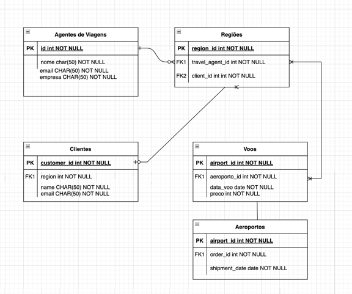

# Search Flight

Esse repositório contém o código fonte do projeto Search Flight, que é um sistema voltado para agências de viagens, que permite a busca de voos através de regiões personalizadas. Isso visa solucionar um problema bastante comum para clientes, que precisam buscar voos de forma manual, aeropor aeroporto, para encontrar o melhor preço.

Usando esse sistema é possível criar regiões personalizadas, que podem ser usadas para buscar voos. Por exemplo, é possível criar uma região chamada "Sudeste", que contém os aeroportos de São Paulo, Rio de Janeiro, Minas Gerais e Espírito Santo. Com isso, é possível buscar voos para essa região, ao invés de buscar por cada aeroporto individualmente.

## Instalação

Para instalar o projeto, basta ter o [Docker](https://www.docker.com/) instalado na máquina. Com o Docker instalado, basta executar o comando abaixo na raiz do projeto:

```bash
docker-compose up -d --build 
```

## Uso

Usando o Docker, o projeto estará disponível na porta 8000. Para acessar, basta abrir o navegador e acessar o endereço [http://localhost:8080](http://localhost:8080).

Com ele você poderá criar um usuário e fazer login. Após isso, você poderá criar regiões e compartilhar com seus clientes através de um link. Seus clientes poderão acessar esse link e buscar voos para a região compartilhada.


## Contribuição

Pull requests são bem-vindos. Para grandes mudanças, por favor abra uma issue primeiro para discutir o que você gostaria de mudar.

## Licença

[MIT](https://choosealicense.com/licenses/mit/)

## Autor

[Luis Antonio Momm Duarte](luismomm@gmail.com)

## Modelagem de Dados:



## Arquitetura do Projeto:

### Visão geral:


## Visão dos containers:


## Visão dos componentes:


