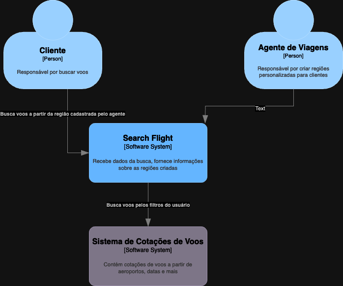

# Portfólio de Projeto

## Objetivos: 

- [ ] Criar um sistema que permita que o agente de viagens ofereça voos para múltiplos destinos, criando regiões de interesse e buscando voos para essas regiões

## Escopo do Projeto:

- [ ] O sistema deve permitir que o usuário busque voos para múltiplos destinos
- [ ] O sistema deve permitir que o usuário busque voos para determinadas regiões
- [ ] O sistema deve permitir que o usuário busque voos para determinados países
- [ ] O sistema deve permitir que o usuário busque voos dentro de um raio de quilômetros a partir de um ponto
- [ ] O sistema deve permitir que o usuário busque voos para determinadas datas
- [ ] O sistema deve permitir que o usuário busque voos para determinados horários
- [ ] O sistema deve permitir que o usuário que as regiões de interesse sejam salvas
- [ ] O sistema deve permitir que o usuário que as buscas sejam compartilhadas

## Contexto do Projeto:

O sistema irá facilitar a busca de voos para múltiplos destinos, permitindo que o usuário busque voos para determinadas regiões, países, datas e horários, sem precisar buscar um por um.
Isso irá facilitar a vida do usuário, que não precisará ficar buscando voos para cada destino que poderia ir, um caso de uso comum na indústria de viagens. Ele será disponível por meio de um site, que poderá ser acessado por qualquer dispositivo com acesso a internet em plataform web.

## Restrições do Projeto:

- [ ] O sistema não vai permitir compras de passagens
- [ ] O sistema não vai salvar histórico de buscas
- [ ] O sistema não vai permitir que o usuário crie uma conta
- [ ] O sistema não vai permitir que o usuário salve buscas
- [ ] O sistema não vai permitir que o usuário crie alertas de preços
- [ ] O sistema não vai permitir que o usuário crie alertas de disponibilidade

##  C4 - Geral

## Trade-offs

- O sistema não vai permitir compras de passagens pois não temos acesso a API de compra de passagens
- O sistema não terá aplicativo mobile por falta de tempo 

## C4 - Containers

