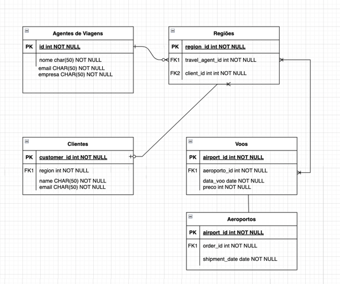
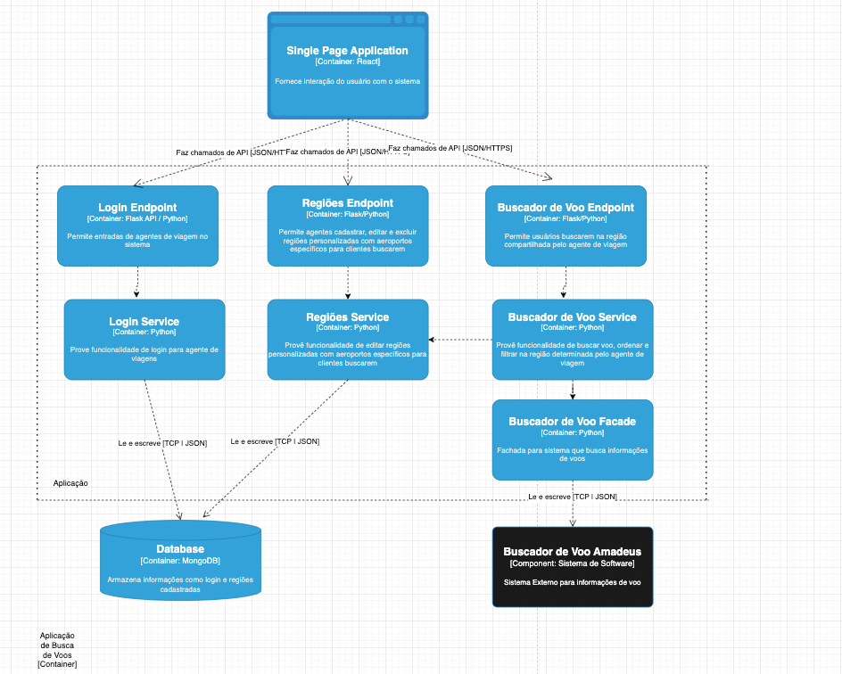

# Search Flight


Esse repositório contém o código fonte do projeto Search Flight, que é um sistema voltado para agências de viagens, que permite a busca de voos através de regiões personalizadas. Isso visa solucionar um problema bastante comum para clientes, que precisam buscar voos de forma manual, aeropor aeroporto, para encontrar o melhor preço.

Usando esse sistema é possível criar regiões personalizadas, que podem ser usadas para buscar voos. Por exemplo, é possível criar uma região chamada "Sudeste", que contém os aeroportos de São Paulo, Rio de Janeiro, Minas Gerais e Espírito Santo. Com isso, é possível buscar voos para essa região, ao invés de buscar por cada aeroporto individualmente.

## Instalação

Para instalar o projeto, basta ter o [Docker](https://www.docker.com/) instalado na máquina. Com o Docker instalado, basta executar o comando abaixo na raiz do projeto:

```bash
docker-compose up -d --build 
```

## Uso

Usando o Docker, o projeto estará disponível na porta 8000. Para acessar, basta abrir o navegador e acessar o endereço [http://localhost:8080](http://localhost:8080).

Com ele você poderá criar um usuário e fazer login. Após isso, você poderá criar regiões e compartilhar com seus clientes através de um link. Seus clientes poderão acessar esse link e buscar voos para a região compartilhada.


## Contribuição

Pull requests são bem-vindos. Para grandes mudanças, por favor abra uma issue primeiro para discutir o que você gostaria de mudar.

## Licença

[MIT](https://choosealicense.com/licenses/mit/)

## Autor

[Luis Antonio Momm Duarte](luismomm@gmail.com)

## Modelagem de Dados:



## Arquitetura do Projeto:

### Visão geral:


### Visão dos containers:


### Visão dos componentes:



## Requisitos do projeto 

### Requisitos Funcionais: 

- [] sistema deve permitir que o usuário veja os voos da região cadastrada
- [] sistema deve permitir a adição de filtros como preço, passageiros e data
- [] sistema deve permitir que o agente de viagens crie, edite e exclua regiões.
- [] sistema deve permitir ordenação por distância da origem, preço e duração em horas
- [] sistema deve permitir login para o agente de viagem

### Requisitos Não Funcionais:

- [] O sistema deve ser responsivo
- [] O sistema deve ser de fácil uso 
- [] O sistema deve estar disponível sempre
- [] O sistema deve ter um tempo de resposta imediato ou rápido
- [] O sistema deve ser tolerante a falhas de usuário ou servidor
- [] O sistema deve ser maleável para mudanças de regras de negócio ou design
- [] O sistema deve manter as informações de forma segura e confidenciais.

## Casos de uso:

- [ ] O sistema deve permitir que o cliente final busque voos para determinadas regiões
- [ ] O sistema deve permitir que o agente de viagem crie regiões e salve-as
- [ ] O sistema deve permitir que o agente de viagem faça login para ver suas regiões criadas
- [ ] O sistema deve permitir que o cliente busque voos para determinados horários
- [ ] O sistema deve permitir que o cliente filtre por preço e número de passageiros
- [ ] O sistema deve permitir que o usuário que as buscas sejam compartilhadas


## Restrições do Projeto:

- [ ] O sistema não vai permitir compras de passagens
- [ ] O sistema não vai salvar histórico de buscas
- [ ] O sistema não vai permitir que o usuário crie uma conta
- [ ] O sistema não vai permitir que o usuário salve buscas
- [ ] O sistema não vai permitir que o usuário crie alertas de preços
- [ ] ## Casos de uso:

- [ ] O sistema deve permitir que o cliente final busque voos para determinadas regiões
- [ ] O sistema deve permitir que o agente de viagem crie regiões e salve-as
- [ ] O sistema deve permitir que o agente de viagem faça login para ver suas regiões criadas
- [ ] O sistema deve permitir que o cliente busque voos para determinados horários
- [ ] O sistema deve permitir que o cliente filtre por preço e número de passageiros
- [ ] O sistema deve permitir que o usuário que as buscas sejam compartilhadas


## Restrições do Projeto:

- [ ] O sistema não vai permitir compras de passagens
- [ ] O sistema não vai salvar histórico de buscas
- [ ] O sistema não vai permitir que o usuário crie uma conta
- [ ] O sistema não vai permitir que o usuário salve buscas
- [ ] O sistema não vai permitir que o usuário crie alertas de preços

## Ferramentas: 

As principais ferramentas utilizadas no projeto são:

- [Docker](https://www.docker.com/)
- [Docker Compose](https://docs.docker.com/compose/)
- [Python](https://www.python.org/)
- [Pytest](https://docs.pytest.org/en/stable/)
- [Flask](https://flask.palletsprojects.com/en/1.1.x/)
- [MongoDB](https://www.mongodb.com/)
- [React](https://reactjs.org/)
- [Material UI](https://material-ui.com/)
- [Amadeus](https://developers.amadeus.com/)

Não é necessário instalar as ferramentas acima, pois o Docker irá instalar tudo automaticamente.

## Infraestrutura:

- [AWS](https://aws.amazon.com/pt/)
- [EC2](https://aws.amazon.com/pt/ec2/)
- Github Actions

## Metolodogia de Desenvolvimento:

A metolodogia de desenvolvimento utilizada foi o [Kanban](https://pt.wikipedia.org/wiki/Kanban_(desenvolvimento_de_software)).
Para design de software foi utilizado o [C4 Model](https://c4model.com/), com arquitetura Clean Architecture e Domain Driven Design.


## Trade-offs

- O sistema não vai permitir compras de passagens pois não temos acesso a API de compra de passagens
- O sistema não terá aplicativo mobile por falta de tempo 
- O sistema não terá aviso de notificação por focar na arquitetura de busca e gerenciamento de regiões.


## Pacotes

- Pacote 1 - Definição da Arquitetura, Documentação e Infraestratura
- Pacote 2 - Criação de parte inicial dos casos de uso
- Pacote 3 - Criação da parte final dos casos de uso e deploy em Cloud
